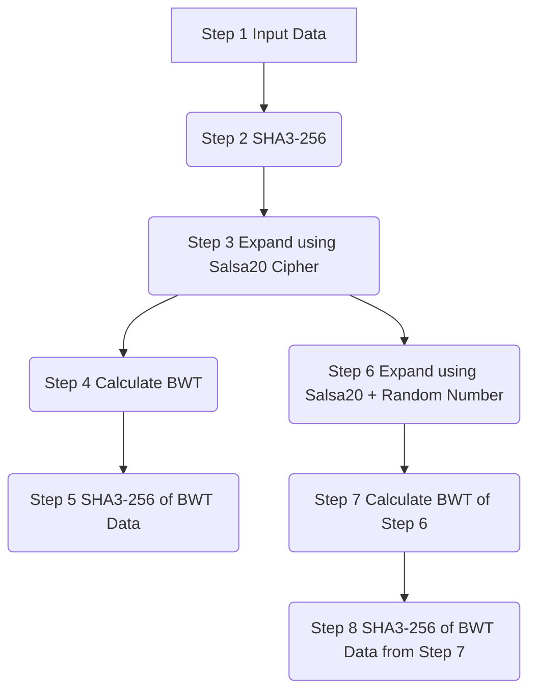

# DERO AstroBWT CPU Mining Proof-of-Work

**AstroBWT Mainnet HardFork on block 4550555, March 7, 2020. ~0200-GMT. DERO HardFork on block 4550555, March 7, 2020. ~0200-GMT.**

## AstroBWT Building

```bash
go get -u github.com/deroproject/astrobwt/miner
```

### Sample Output

```
DERO AstroBWT Miner v0.01 alpha  
CPU: Intel(R) Xeon(R) CPU E3-1270 v6 @ 3.80GHz    PhysicalThreads:1  
      Threads           Total Time     Total Iterations            Time/PoW         Hash Rate/Sec  
            1         3.272996982s                  100          32.729969ms                 30.6  
            2         3.572288466s                  200          17.861442ms                 56.0  
            3         4.013980986s                  300          13.379936ms                 74.7  
            4         4.704899609s                  400          11.762249ms                 85.0  
            5         5.784798143s                  500          11.569596ms                 86.4  
            6         6.629462384s                  600          11.049103ms                 90.5  
            7         8.351780961s                  700          11.931115ms                 83.8  
            8         10.49473002s                  800          13.118412ms                 76.2
```
## AstroBWT Pseudo CODE
This algorithm is a Proof of Work (PoW) mechanism used in cryptocurrencies or distributed systems to secure and validate transactions or blocks. Here's a breakdown of the steps outlined in the pseudocode:
```
def AstroBWT(input String): 
    # Input -> SHA256 -> Salsa20 -> anti-FPGA loop -> BWT -> SHA256 = Pow hash
    Step1 = SHA3-256(input)  # Calculate SHA3-256 hash of input data
    Step2 = Salsa20(Step1)  # Expand the data via Salsa20, 69371 bytes
    loop:
        Step3 = anti-FPGA(Step2)  # anti-FPGA loop
    Step4 = BWT(Step3)  # Calculate BWT of step 3
    Step5 = SHA3-256(Step4)  # Calculate final POW hash
    return Step5
```
## AstroBWT Cryptographic Process:


1. **Input Data:** This represents the initial data set that serves as the starting point for the process.
2. **SHA3-256:** It's a cryptographic hash function used to produce a fixed-size output (256 bits) called a hash value or digest. The hash is computed based on the input data using the SHA3-256 algorithm, providing a unique representation of the input data.
3. **Expand using Salsa20 Cipher:** Salsa20 is a stream cipher known for its speed and security. Expanding the data using the Salsa20 cipher involves generating a longer sequence of pseudorandom bits (expanding the initial data) using the cipher's encryption mechanism.
4. **Calculate BWT:** The Burrows-Wheeler Transform (BWT) is applied to the expanded data. It's a reordering technique used in data compression. The BWT rearranges the symbols within the data, creating a transformed version suitable for improved compression.
5. **SHA3-256 of BWT Data:** Similar to Step 2, this calculates the SHA3-256 hash of the BWT-transformed data obtained in Step 4. It provides a fixed-size representation of the transformed data for verification or identification purposes.
6. **Expand using Salsa20 + Random Number:** This step involves additional expansion of the data using the Salsa20 cipher, but with an extra random number. The random number is derived from the SHA3-256 result obtained in Step 4, adding a layer of randomness to the expanded data.
7. **Calculate BWT of Step 6:** The BWT is recalculated for the further expanded data obtained in Step 6. This process repeats the transformation technique on the newly modified dataset.
8. **SHA3-256 of BWT Data from Step 7:** Similar to Steps 2 and 5, this calculates the SHA3-256 hash of the BWT-transformed data obtained in Step 7, providing a unique and fixed-size representation of the final transformed data after multiple expansions and BWT calculations.

More about AstroBWT here: [Explaining AstroBWT](/features/astroBWT)
