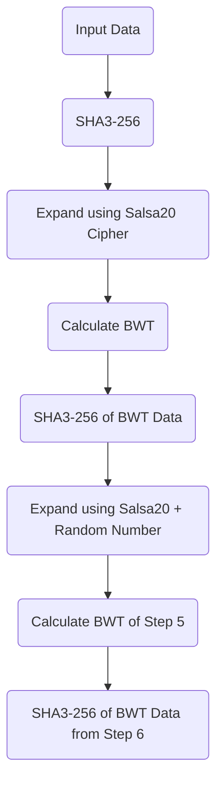

# DERO AstroBWT CPU Mining Proof-of-Work

**AstroBWT Mainnet HardFork on block 4550555, March 7, 2020. ~0200-GMT. DERO HardFork on block 4550555, March 7, 2020. ~0200-GMT.**

## AstroBWT Building

```bash
go get -u github.com/deroproject/astrobwt/miner
```

### Sample Output

```
DERO AstroBWT Miner v0.01 alpha  
CPU: Intel(R) Xeon(R) CPU E3-1270 v6 @ 3.80GHz    PhysicalThreads:1  
      Threads           Total Time     Total Iterations            Time/PoW         Hash Rate/Sec  
            1         3.272996982s                  100          32.729969ms                 30.6  
            2         3.572288466s                  200          17.861442ms                 56.0  
            3         4.013980986s                  300          13.379936ms                 74.7  
            4         4.704899609s                  400          11.762249ms                 85.0  
            5         5.784798143s                  500          11.569596ms                 86.4  
            6         6.629462384s                  600          11.049103ms                 90.5  
            7         8.351780961s                  700          11.931115ms                 83.8  
            8         10.49473002s                  800          13.118412ms                 76.2
```
## AstroBWT Pseudo CODE
This algorithm is a Proof of Work (PoW) mechanism used in cryptocurrencies or distributed systems to secure and validate transactions or blocks. Here's a breakdown of the steps outlined in the pseudocode:
```
def AstroBWT(input String): 
    # Input -> SHA256 -> Salsa20 -> anti-FPGA loop -> BWT -> SHA256 = Pow hash
    Step1 = SHA3-256(input)  # Calculate SHA3-256 hash of input data
    Step2 = Salsa20(Step1)  # Expand the data via Salsa20, 69371 bytes
    loop:
        Step3 = anti-FPGA(Step2)  # anti-FPGA loop
    Step4 = BWT(Step3)  # Calculate BWT of step 3
    Step5 = SHA3-256(Step4)  # Calculate final POW hash
    return Step5
```

```mermaid
graph TD;

inputData(Input Data)
calcSHA3(SHA3-256)
expandSalsa20(Expand using Salsa20 Cipher)
calculateBWT(Calculate BWT)
calcSHA3BWT(SHA3-256 of BWT Data)
expandSalsa20Random(Expand using Salsa20 + Random Number)
calculateBWTStep6(Calculate BWT of Step 5)
calcSHA3BWTStep6(SHA3-256 of BWT Data from Step 6)

inputData --> calcSHA3
calcSHA3 --> expandSalsa20
expandSalsa20 --> calculateBWT
calculateBWT --> calcSHA3BWT
calcSHA3BWT --> expandSalsa20Random
expandSalsa20Random --> calculateBWTStep6
calculateBWTStep6 --> calcSHA3BWTStep6
```

This flowchart outlines the sequential steps involved in the cryptographic process:

1. **Input Data:** Represents the initial data.
2. **SHA3-256:** Calculation of the SHA3-256 hash of the input data.
3. **Expand using Salsa20 Cipher:** Expansion of the data using the Salsa20 cipher.
4. **Calculate BWT:** Calculation of the Burrows-Wheeler Transform (BWT) of the expanded data.
5. **SHA3-256 of BWT Data:** Calculation of the SHA3-256 hash of the BWT data obtained in the previous step.
6. **Expand using Salsa20 + Random Number:** Expansion of data using Salsa20 with an additional random number based on the SHA3-256 result from Step 4.
7. **Calculate BWT of Step 5:** Calculation of the BWT of the data obtained in Step 6.
8. **SHA3-256 of BWT Data from Step 6:** Calculation of the SHA3-256 hash of the BWT data obtained in Step 7.

More about BWT here: [Explaining AstroBWT](/features/astroBWT)
