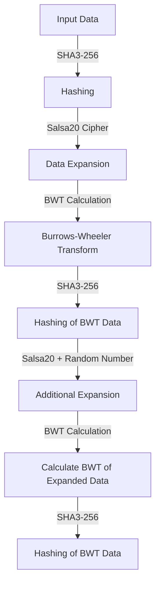

import Image from 'next/image';

# AstroBWT

AstroBWT stands out as a cryptocurrency mining innovation. It's an advanced CPU mining algorithm designed to resist specialized mining hardware such as ASICs, FPGAs, and GPUs. What makes AstroBWT particularly intriguing is its foundation in mathematical proofs, setting it apart from conventional CPU mining algorithms commonly used in the cryptocurrency sphere.

At its core, AstroBWT leverages the Burrows-Wheeler Transform (BWT), a sophisticated data reordering technique derived from Information Theory and Compression Domains. Unlike many existing mining algorithms that follow predetermined computational paths, AstroBWT takes a different route by incorporating the BWT, which has been a subject of extensive research for over three decades.

Despite this innovation, AstroBWT faces a challenge in optimizing its performance on GPUs or FPGAs. Major technology companies like Intel and NVIDIA have developed optimized versions of BWT, but their implementations haven't yet significantly surpassed CPU performance in the mining context.

AstroBWT represents a crossroads between cryptography, computational theory, and real-world applications. Its success could signify not only a breakthrough in mining technology but also broader implications for scientific innovation in various domains.
## Scientific Impacts
Beyond cryptocurrency, optimized AstroBWT could revolutionize domains like Bioinformatics and DNA Sequencing. A more efficient BWT algorithm could lead to groundbreaking advancements in scientific research.

More about AstroBWT here: [Explaining AstroBWT](/dvm/astroBWT)

