import { Callout } from 'nextra/components'

# TELA Security Model

<Callout type="success" emoji="🔒">
**Zero-Trust Architecture:** TELA applications run on-chain with cryptographic verification. No servers to compromise, no code injection, no hidden changes.
</Callout>

## How TELA Security Works


**Result:** Applications are verifiable, immutable, and censorship-resistant.

## TELA vs Traditional Web Security

| Security Layer | Traditional Web | TELA |
|----------------|-----------------|------|
| **Code Storage** | 👁️ Server (can change anytime) | 🔒 Blockchain (immutable) |
| **Code Integrity** | ⚠️ Trust the server | ✅ Cryptographically verified |
| **Execution** | 🌐 Remote server | 💻 Local (your computer) |
| **Backend** | 🔓 Centralized database | 🔐 Smart contracts |
| **Updates** | ❌ Silent, undetectable | ✅ Transparent on-chain |
| **Censorship** | ❌ Can be taken down | ✅ Unstoppable |
| **Privacy** | 👁️ Server logs everything | 🔒 Local execution |

---

## 5 Security Layers

### 🔐 **Layer 1: Blockchain Immutability**

**Once deployed → Forever locked**


**What this means:**
- ✅ Code cannot be modified after deployment
- ✅ No server-side code injection
- ✅ Historical record of all versions
- ✅ Prevents malicious updates

---

### 🔑 **Layer 2: Cryptographic Verification**

**Every file has a mathematical proof**

| What Gets Verified | How |
|-------------------|-----|
| **File Integrity** | SHA-256 hash on blockchain |
| **Author Identity** | DERO wallet address (cryptographic signature) |
| **Contract Linkage** | Cryptographic references between DOC-1 and INDEX-1 |
| **Code Authenticity** | Blockchain consensus (51% attack required to forge) |

**Verification process:**
```
1. User requests app
2. Engram fetches code from blockchain
3. Calculates hash of downloaded code
4. Compares to hash in INDEX-1 contract
5. ✅ Match = authentic | ❌ Mismatch = reject
```

---

### 💻 **Layer 3: Local Execution**

**Code runs on YOUR computer, not a server**

**Attack Vectors Eliminated:**
- ❌ Server-side attacks (no server!)
- ❌ Database breaches (no database!)
- ❌ Man-in-the-middle (cryptographically verified)
- ❌ Session hijacking (no sessions!)
- ❌ Server logging (runs locally)

**Modern Browser Protection:**
- ✅ Sandboxed execution
- ✅ Content Security Policy (CSP)
- ✅ Same-origin policy
- ✅ Memory isolation

---

### 📦 **Layer 4: Dual-Contract Architecture**

**Separation of code and metadata**

```mermaid
graph TB
    subgraph "TELA-DOC-1 (Immutable)"
        CODE[Application Code<br/>HTML, CSS, JS]
        LOCKED[🔒 Cannot Change<br/>Hash-Verified]
    end
    
    subgraph "TELA-INDEX-1 (Updateable)"
        META[Metadata<br/>Name, Icon, Version]
        REFS[References to DOC-1]
        UPDATE[✅ Can Update<br/>Points to new DOC-1]
    end
    
    DOC -->|Contains| CODE
    CODE -->|Verified by| LOCKED
    
    IDX -->|Contains| META
    IDX -->|Points to| DOC
    META -->|Allows| UPDATE
```



**Why this is secure:**
- ✅ Code (DOC-1) is immutable = can't inject malware
- ✅ Metadata (INDEX-1) is updateable = app can improve
- ✅ User can verify which DOC-1 version they're running
- ✅ Transparency: All changes visible on-chain

---

### 🌐 **Layer 5: Decentralized Trust**

| Trust Mechanism | How It Works |
|-----------------|--------------|
| **Author Accountability** | Wallet address = permanent identity on-chain |
| **Community Ratings** | Users rate apps (stored on-chain) |
| **Transparency** | All code visible = community audit |
| **No Gatekeepers** | Anyone can deploy, users decide trust |
| **Reputation** | Author's history = visible on blockchain |

---

## Security Best Practices

### 👨‍💻 **For Developers**

| Practice | Why It Matters |
|----------|----------------|
| **Validate ALL inputs** | Prevent XSS and injection attacks |
| **Verify 3rd-party libraries** | External code = potential vulnerability |
| **Minimize dependencies** | Smaller attack surface |
| **Test thoroughly** | Use TELA-CLI for security testing |
| **Document permissions** | Be transparent about what your app needs |
| **Version your DOC-1s** | Users can choose which version to trust |

<Callout type="warning">
**Remember:** Your code is IMMUTABLE and PUBLIC. Test carefully before deploying!
</Callout>

---

### 👤 **For Users**

| Practice | How To |
|----------|--------|
| **Check author address** | Look up author's other apps on blockchain |
| **Read community ratings** | See what others say about the app |
| **Review permissions** | Understand what access you're granting |
| **Keep Engram updated** | Latest security patches |
| **Start with low-risk apps** | Test with documents/games before financial apps |

**Red Flags:**
- 🚨 App requests unnecessary permissions
- 🚨 Unknown author with no history
- 🚨 Poor community ratings
- 🚨 Requests private keys (NEVER legitimate!)

---

## The Bottom Line

**TELA's Multi-Layer Defense:**

```mermaid
graph TD
    APP[TELA Application]
    
    APP --> L1[🔐 Blockchain Immutability]
    APP --> L2[🔑 Cryptographic Verification]
    APP --> L3[💻 Local Execution]
    APP --> L4[📦 Dual-Contract Design]
    APP --> L5[🌐 Community Trust]
    
    L1 --> SEC[🛡️ Comprehensive<br/>Security]
    L2 --> SEC
    L3 --> SEC
    L4 --> SEC
    L5 --> SEC
```



**TELA Security = Multiple independent layers**

If one layer is bypassed, others remain protective. This defense-in-depth approach makes TELA significantly more secure than traditional web applications.

---

## Comparison: TELA vs Web2

**Traditional Web:**
```
Trust the company → Trust the server → Hope they're secure
```

**TELA:**
```
Verify on blockchain → Run locally → You control security
```

**Difference:** TELA removes trust requirements through cryptographic proof and decentralization. 